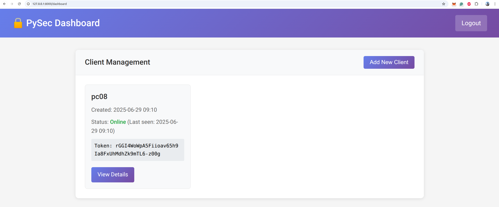
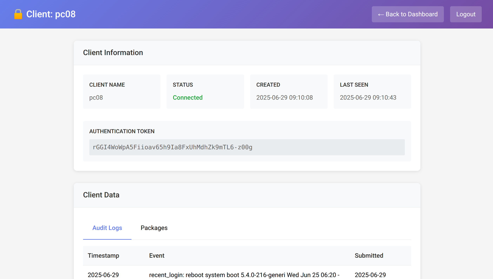

# pysec

FOSS endpoint security application.

Originally, the idea was to give you some chance to get your notebook back if it
was stolen ([original project](https://github.com/MartinThoma/pysec-notebook)).
Now, the goal is a bit broader: It should help you to keep your system secure.

pysec offers the following components:

1. `pysec audit config`: A tool to check the security configuration of a system.
2. `pysec audit packages`: Get a list of all installed packages and CVEs related to them.

## Features

### Server-Client System

You can add new clients by giving them a token. The client will appear in the
dashboard:



You can then get a detailed view of the client, including the installed
packages and an auit log of the client:




## Try it out!

You might need to install [`pipx`](https://pypi.org/project/pipx/) first:

```
git clone https://github.com/MartinThoma/pysec.git
pipx install -e .
```

### Examples

```bash
# Audit system configuration
$ pysec audit config
Running system configuration audit...
- Found checker: UbuntuSecurityChecker
- Installed packages: 3865
✗ Disk is NOT encrypted
✓ Screen locks after 15 minutes
✓ Automatic daily updates are enabled

# Start the server for client management
$ pysec server start
Starting pysec Django server on 127.0.0.1:8000
Access the dashboard at: http://127.0.0.1:8000/

# Set up the database (first time only)
$ pysec server manage.py migrate
$ pysec server manage.py createsuperuser

# Create a client token
$ pysec server manage.py create_client myclient

# Configure a client to report to server
$ pysec client configure --server-url http://server:8000 --token TOKEN

# Run client audit and send to server
$ pysec client run
```


## Supported platforms

At the moment only Ubuntu, but you can have a look at `oschecks/ubunut.py`.
Only some very basic checks need to be implemented for other platforms.


Simply copy the `ubuntu.py`, adjust the commands accordingly and make a pull request :-)
